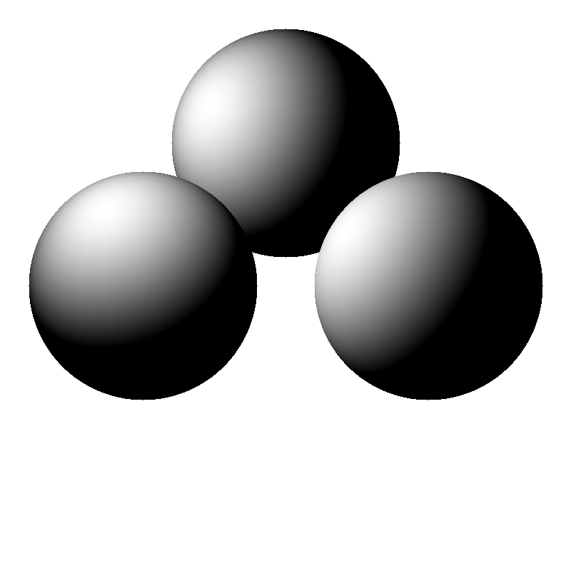
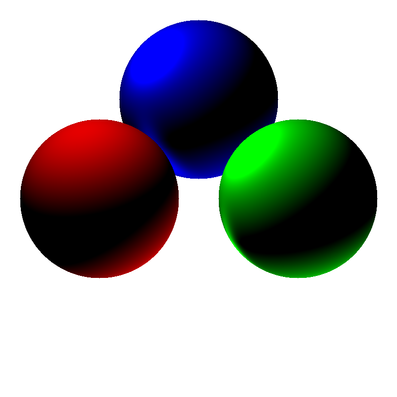
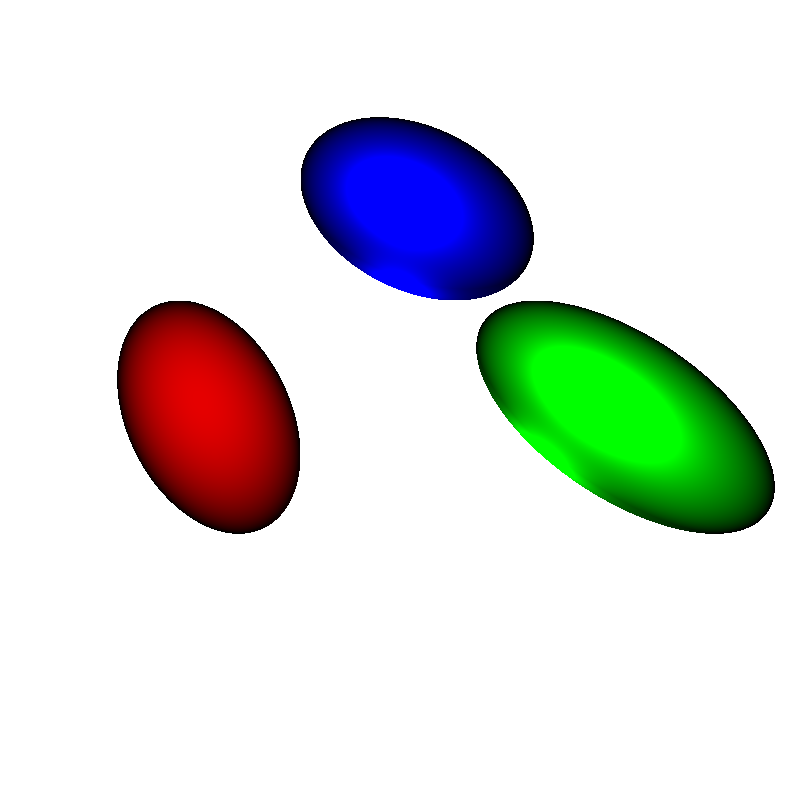
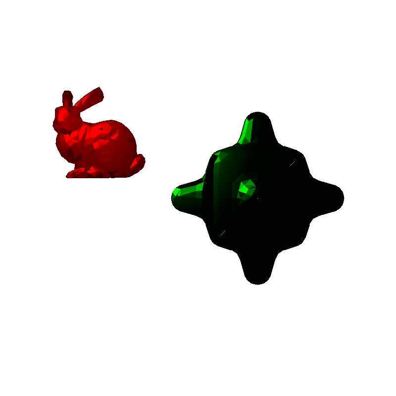
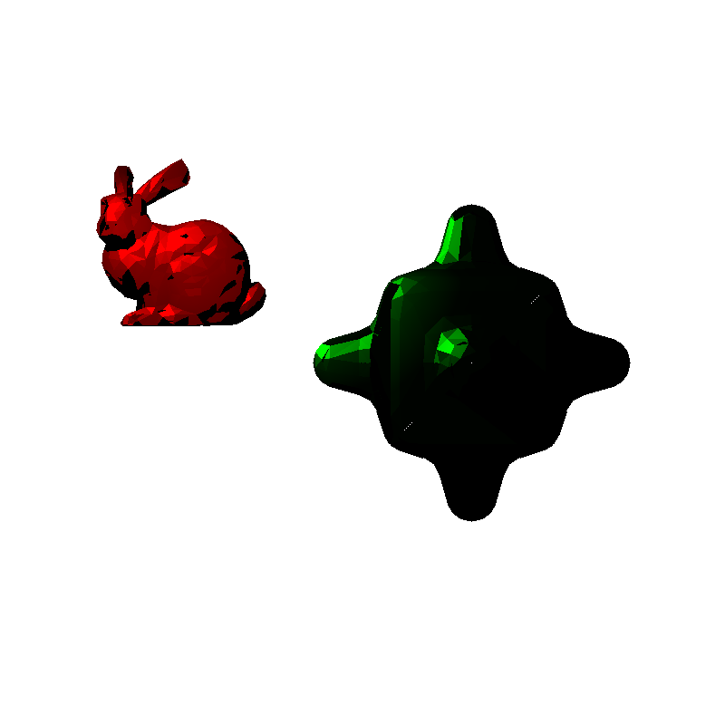
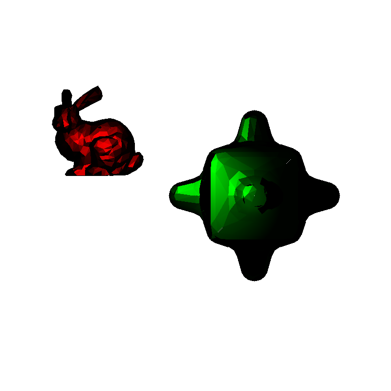
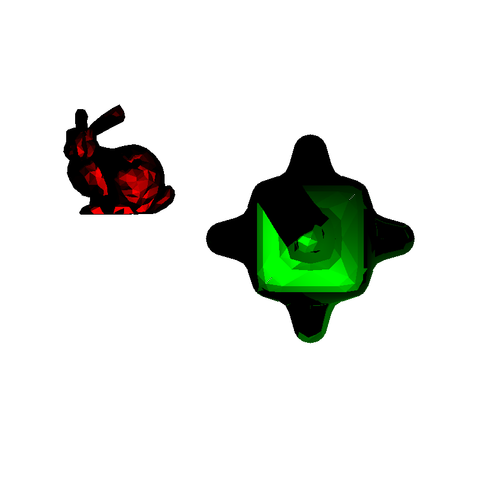

# Assignment 1 - Ray Tracing 

Radhika Mattoo, rm3485@nyu.edu
## Overview
I have split up the portions of the homework (sections 1.1 to 1.6) into separate functions in my `main.cpp` file.

To run a specific part of the homework, say 1.3, you simply go to the `main()` function at the bottom of `main.cpp`, and uncomment the function call `part3()`.

This is the same format for all parts of the homework.

## Setup
`git clone --recursive https://github.com/NYUCG2017/assignment-1-radhikamattoo.git`

## Running

`mkdir build`

`cd build`

`cmake ../`

`make && ./Assignment1_bin`

## 1.1 Ray Tracing Spheres

## 1.2 Shading

## 1.3 Perspective Projection

## 1.4 Ray Tracing Triangle

## 1.5 Shadows

## 1.6 Reflections on the floor
